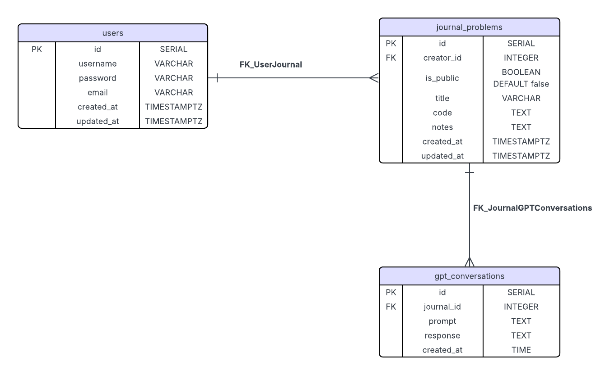

# Leetcode_AI_Assistant
## 📊 Database Schema

###  users
| Column     | Type              | Description                |
|------------|-------------------|----------------------------|
| id         | SERIAL PK         | Unique user ID             |
| username   | VARCHAR(255)      | User's name (unique)       |
| password   | VARCHAR (255)     | User's password            |
| email      | VARCHAR(255)      | User's email (optional)    |
| created_at | TIMESTAMPTZ       | When the user was created  |
| updated_at | TIMESTAMPTZ       | When the user updated info |

###  journal_problems
| Column      | Type         | Description                          |
|-------------|--------------|--------------------------------------|
| id          | SERIAL PK    | Unique journal ID                    |
| creator_id  | INTEGER FK   | References users(id)                 |
| title       | VARCHAR (255)| Title of the journal                 |
| code        | TEXT         | code of the journal                  |
| notes       | TEXT         | Content of the journal               |
| created_at  | TIMESTAMPTZ  | When the journal was created         |
| updated_at  | TIMESTAMPTZ  | When the journal was last updated    |

###  GPT gpt_conversations
| Column      | Type         | Description                          |
|-------------|--------------|--------------------------------------|
| id          | SERIAL PK    | Unique GPT conversation ID           |
| journal_id  | INTEGER FK   | References journal_problems(id)      |
| prompt      | TEXT         | User's GPT prompt                    |
| response    | TEXT         | GPT's reply                          |
| created_at  | TIMESTAMPTZ  | When the conversation was created    |
##  Schema Diagram

